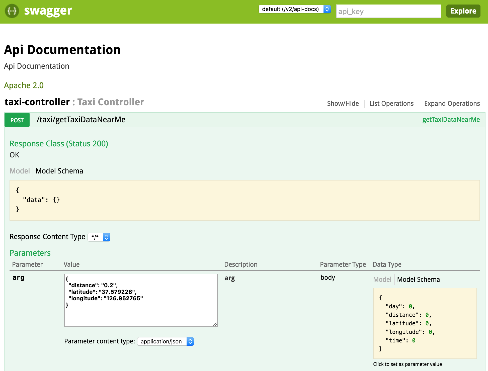
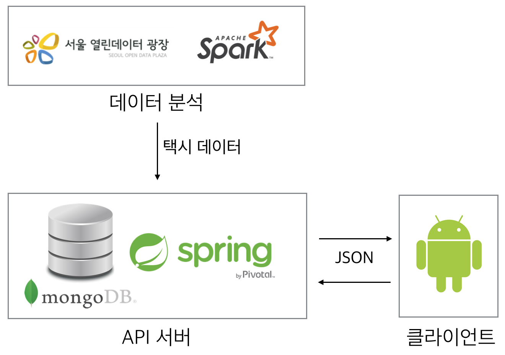

# EASYGRAB API 서버
분석한 택시 승하차 데이터를 MongoDB에 저장하고 서비스하는 API 서버입니다. :)
(2015/01 ~ 2016/04 서울시 택시운행 분석데이터 기준)

## 주요기능
- 택시 타기 좋은 위치 탐색하기

## 주요화면
http://ec2-52-78-187-179.ap-northeast-2.compute.amazonaws.com:8080/taxi-data/swagger-ui.html

## 구현
- Spring 프레임워크 사용
- MongoDB 데이터베이스 사용
- swagger 로 Rest API 문서화

## 디렉토리 구조
- src  
    - controller : URL Mapping
    - domain : 도메인 개념 (위치, 택시 데이터)
    - dto : 계층간 데이터 전송을 위한 클래스
    - service : 비지니스 로직 (택시 타기 좋은 위치 탐색하기)
    
## 구성도

- API 서버 : https://github.com/babjo/EasyGrabApi
- 클라이언트 : https://github.com/babjo/EasyGrab